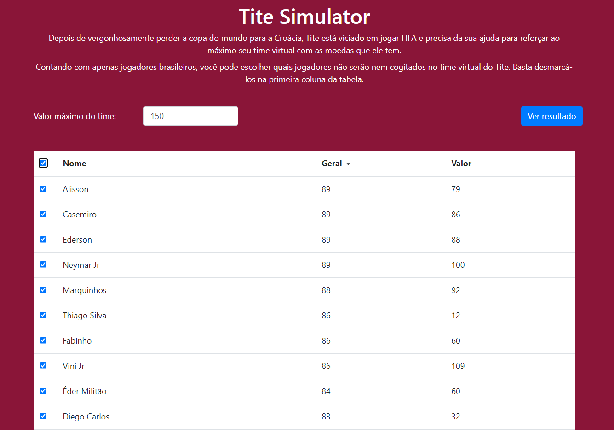
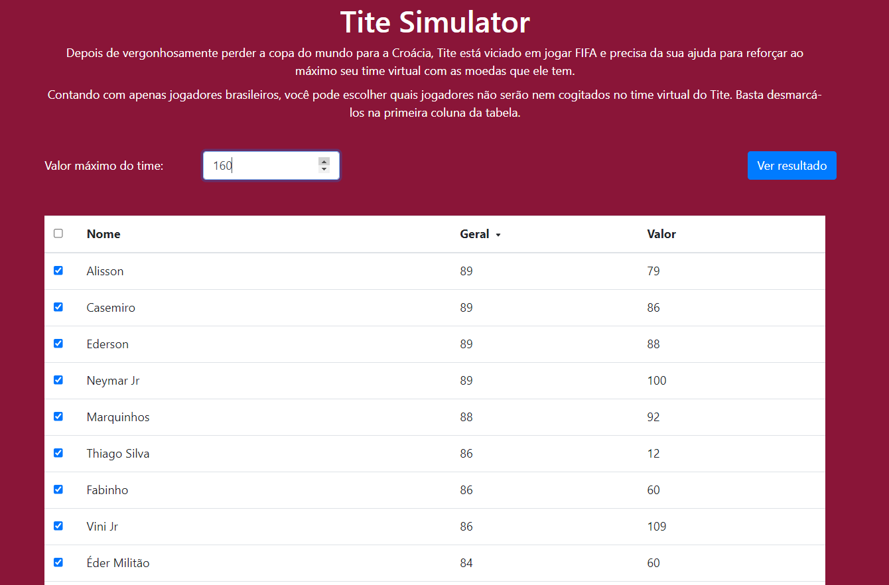
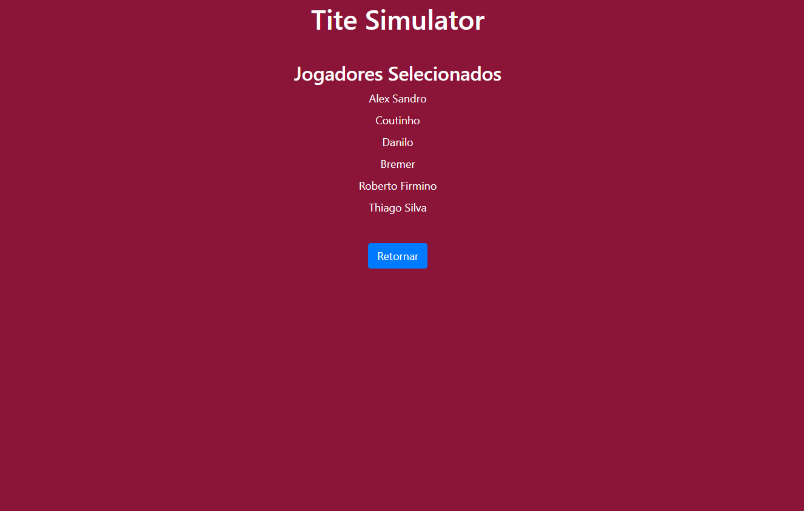

# PD_TiteSimulator

**Número da Lista**: 16 
**Conteúdo da Disciplina**: Programação Dinamica 

## Alunos
| Matrícula | Aluno                                                       |
| --------- | ----------------------------------------------------------- |
| 180063162 | [Daniel Primo](https://github.com/danieldagerom)        |
| 150011903 | [Igor Aragão](https://github.com/roginaldosemog)            |

## Sobre 
O objetivo do projeto é utilizar o algoritmo knapsack (mochila) para ajudar nosso ex-técnico e professor da seleção brasileira, Tite, a comprar jogadores no FIFA tendo o maior aproveitamento dessas moedas, obtendo o máximo de reforços possíveis com a quantia disponível.

## Screenshots

  

  

  

## Apresentação
O vídeo para apresentação se encontra disponível para baixar [AQUI](assets/presentation.mp4)

## Instalação 
**Linguagem**: Javascript 
**Framework**: React 

Para rodar o projeto instale as dependências descritas no [tutorial oficial do React](https://reactjs.org/tutorial/tutorial.html).

Após a instalação, rode os comandos `yarn install` e em seguida `yarn start`.

## Uso 
Selecione a formação desejada e clique em "Ver Resultado".
Também está disponível em https://titesimulator-pd.netlify.app/

